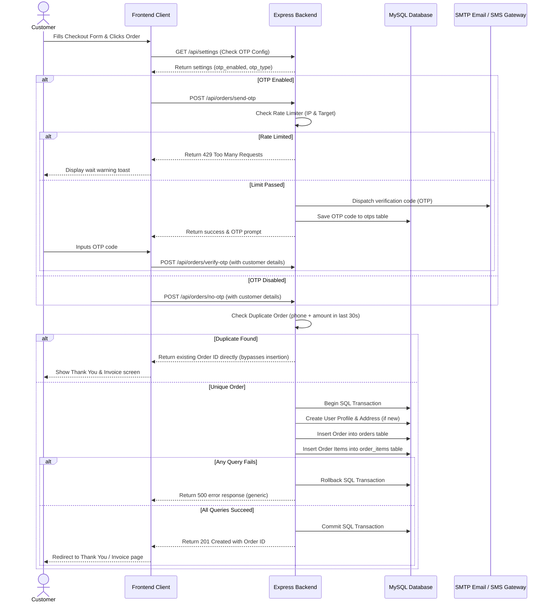
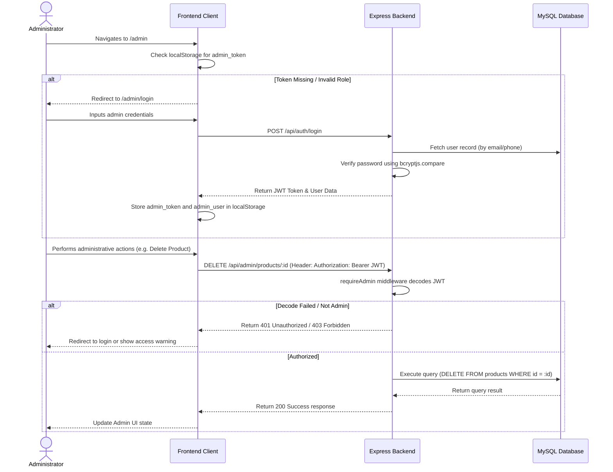

# Ghani Mustard Oil E-Commerce System

A high-converting, single-product e-commerce platform and administrative panel tailored for conversion-focused Facebook/Meta Ads marketing campaigns. The project is designed with mobile-first layouts, integrated server-side conversion tracking, robust security controls, financial cost protection (rate limiting), and order reliability features.

---

## 1. Project Goal & Overview
The core objective of the platform is to drive high-quality customer acquisition for a cold-pressed mustard oil business. The architecture supports rapid Vite frontend rendering, low-latency API calls, and a secure administration workflow to manage products, orders, reviews, and tracking tags in real time.

---

## 2. Requirements & Standards
* **Performance**: Under 2-second page load times on standard mobile devices.
* **Responsive Layout**: Mobile-first design focusing on quick checkout forms and sticky CTA elements.
* **Image Optimization**: Auto-conversion to WebP format for fast delivery.
* **Tracking Integrations**: Built-in support for Google Tag Manager (GTM), Meta Pixel, Google Analytics 4 (GA4), and Facebook Conversion API (CAPI) with server-side proxy tracking.
* **Courier Preparedness**: Prepared data structures for integration with local courier APIs (e.g., Pathao, Steadfast).
* **Billing System**: Printable invoice generator formatted for A4 printing sheets.

---

## 3. System Features List

### Client-Side (Customer Flow)
* **Single Product Showcase**: Highlighting benefits, USPs, cold-press credentials, customer reviews, and payment trust badges.
* **Variant Selector**: Multi-bottle volume variant selections (e.g., 500ml, 1L, 5L) with custom offer pricing and auto-updating values.
* **Express Checkout**: Interactive COD order form with validation.
* **Flexible OTP Verification**: Switchable SMS vs Email verification based on store preferences.
* **Duplicate Order Prevention**: Bypasses duplicate order creation if the same customer places an identical order within 30 seconds (re-confirming checkout directly).
* **OTP Rate Limiting**: Limit of 1 request per 60 seconds per customer target, and 10 requests per hour per IP.
* **Auto-Generated Invoice**: Instant, printable A4 delivery invoice with custom itemizations.

### Administrative Control (Admin Flow)
* **Insights Dashboard**: Visual representation of sales statistics, total revenue, average order value, top-selling products, and regional sales distribution.
* **Order Management**: Order filtering, custom status updates (Pending, Shipped, Cancelled), tracking numbers, and Excel/CSV exporting.
* **Product Manager**: CRUD operations for products, custom attributes, ingredients, variant pricing, stock counts, and URL slugs.
* **Review Moderation**: Approve or reject customer feedback before it goes live on the storefront.
* **Marketing panel**: Controls for building subscriber campaigns, email logs, and newsletters.
* **Tracking & CAPI Settings**: Configuration inputs for Meta Pixel, GTM container codes, and Facebook Conversion API access tokens.
* **Settings & Custom Styling**: Global options for store metadata, delivery charges, and custom site coloring (HSL variables mapped to the site's layout dynamically).

---

## 4. System & Project Architecture

The application is structured as a monorepo workspace divided into two main layers:

```
├── backend/                   # Node.js + Express API
│   ├── uploads/               # Processed static WebP media assets
│   ├── package.json           # Backend dependency configurations
│   └── server.js              # Application entry point, routes, and middleware
├── frontend/                  # React + Vite Client
│   ├── src/
│   │   ├── components/        # Shared components and Layouts
│   │   ├── pages/             # Frontend page controllers (Storefront, Checkout, Dashboard)
│   │   ├── utils/             # Axios API helpers and tracking hooks
│   │   └── App.jsx            # Routing and global themes
│   ├── package.json           # Frontend dependency configurations
│   └── vite.config.js         # Vite configuration file
└── README.md                  # System Documentation
```

### Technical Stack
* **Frontend**: React 18, React Router DOM, Axios, Lucide Icons, Vanilla HSL CSS variables.
* **Backend**: Express, Node.js, Multipart Form upload (`multer`), Image Compressor (`sharp`), Mailer (`nodemailer`), JWT Authentication, `bcryptjs`.
* **Database**: MySQL.
* **Security Controls**:
  * Passwords hashed using standard `bcryptjs`.
  * Administrative routes protected by JSON Web Token (JWT) verification.
  * SQL Transaction blocks (`beginTransaction`, `commit`, `rollback`) protecting multi-table insertions from data corruption.

---

## 5. System Workflows

### Customer Order Flow


### Admin Operations Flow


---

## 6. Development & Run Instructions

### Prerequisites
1. Installed **Node.js** (v18+ recommended).
2. Running **MySQL Database Server** instance.

### Setup Backend `.env` Configuration
Create a `.env` file inside the `backend` folder:
```ini
PORT=5000
DB_HOST=localhost
DB_USER=root
DB_PASSWORD=your_mysql_password
DB_NAME=ghani_db
DB_PORT=3306
JWT_SECRET=your_jwt_signing_secret_key_2026
```

### Installation
From the project root workspace directory:
```bash
# Install root, frontend, and backend packages
npm run install:all
```

### Running the Services
To run both backend and frontend development servers concurrently:
```bash
npm run dev
```
* Frontend client will run on: `http://localhost:5173`
* Backend API server will run on: `http://localhost:5000`

### Building for Production
To build frontend assets:
```bash
npm run build:frontend
```
The compiled static assets will be located in `frontend/dist`.
